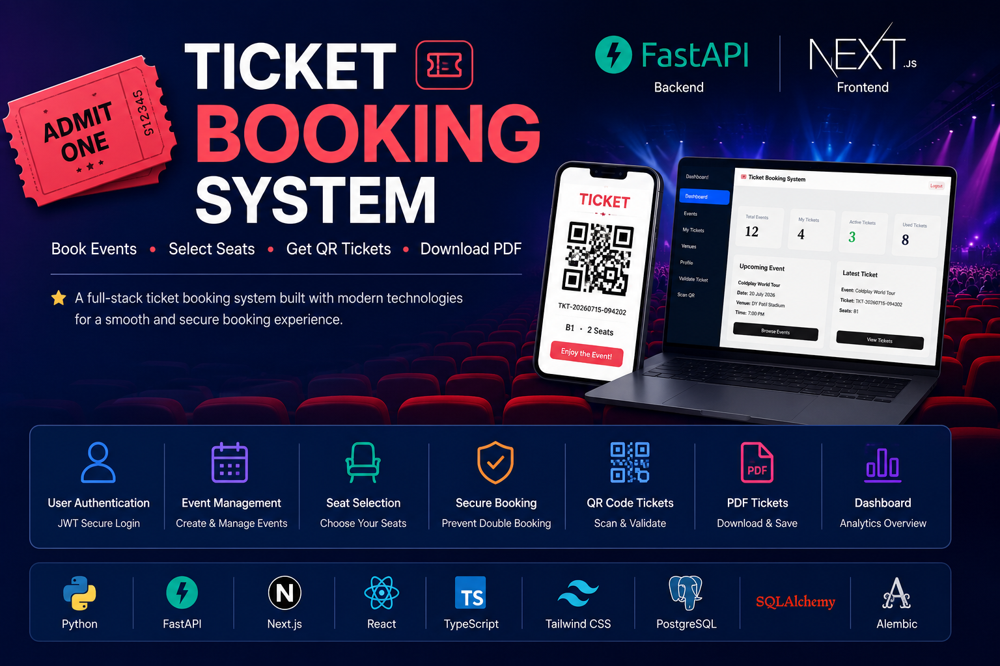
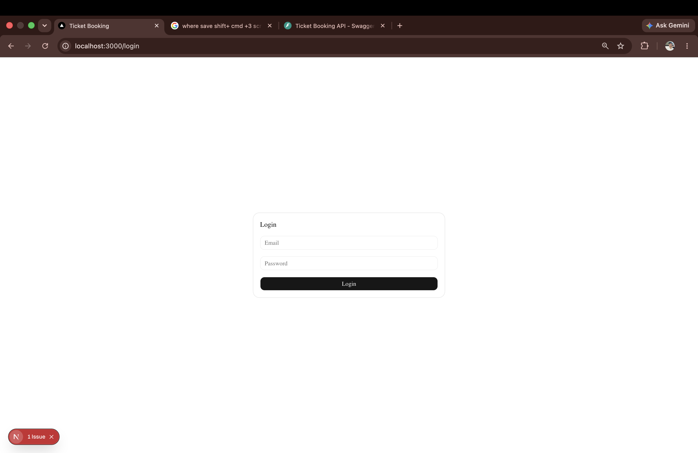
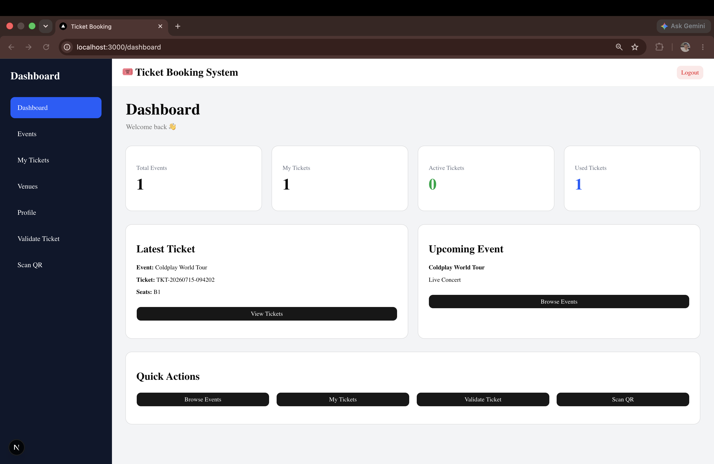
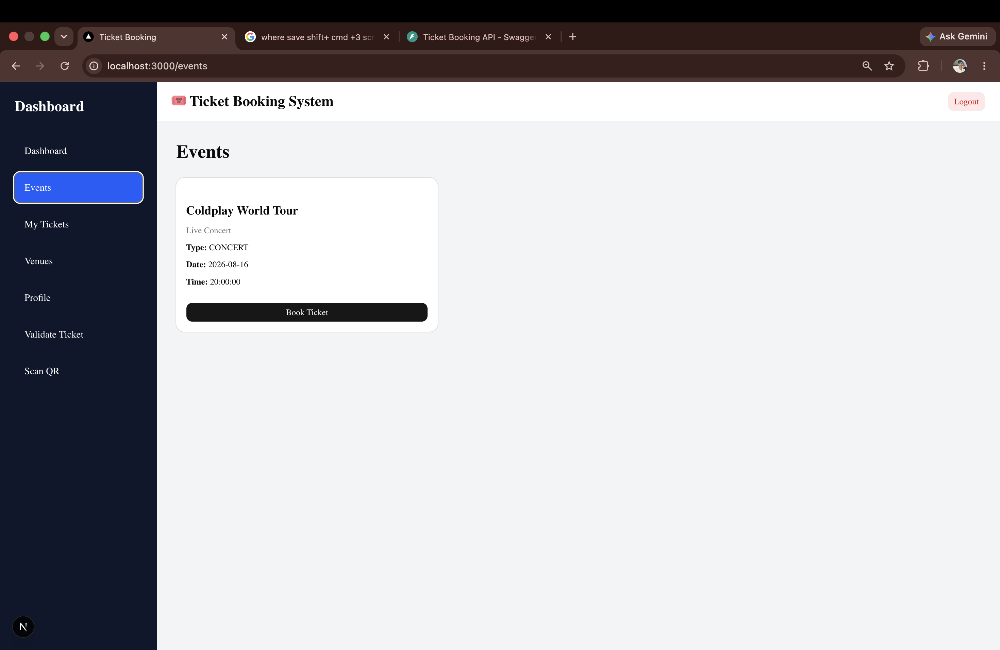
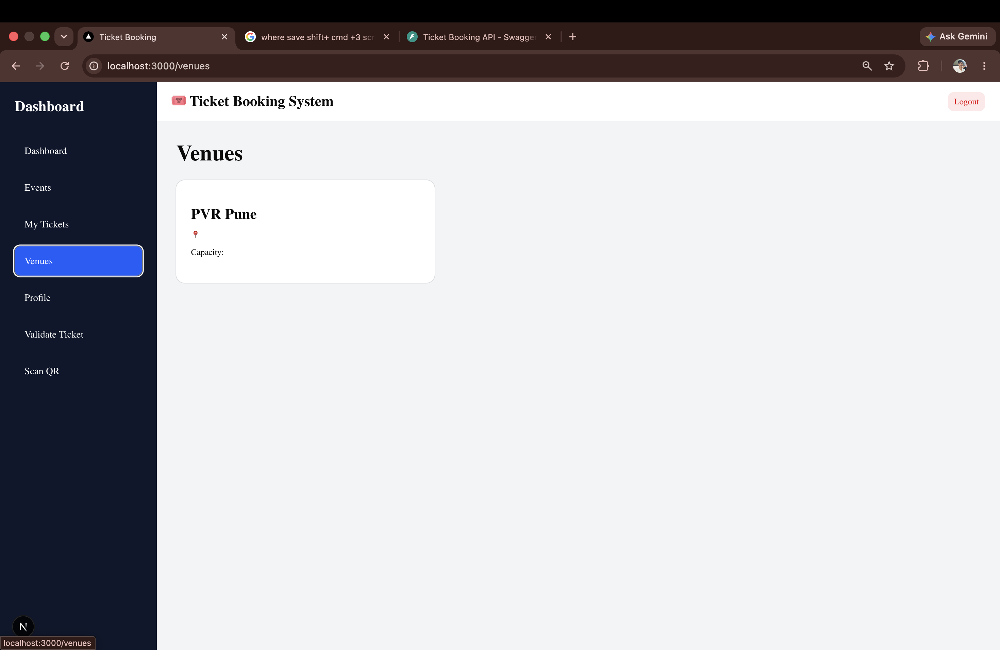
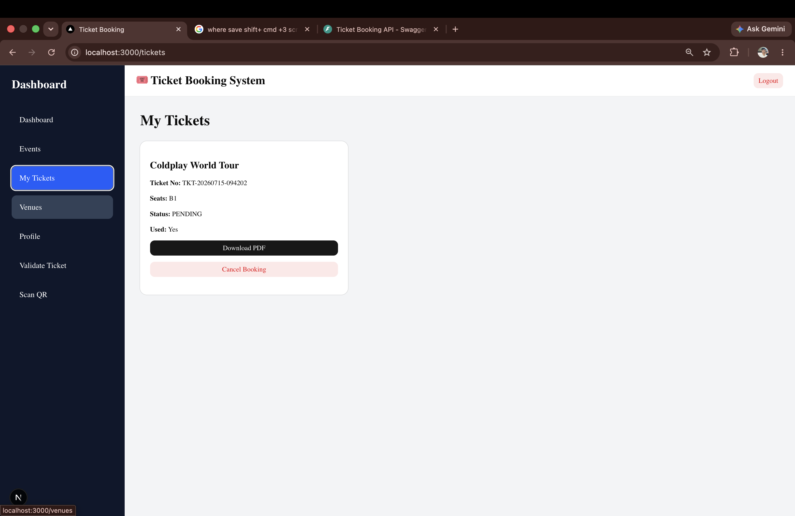
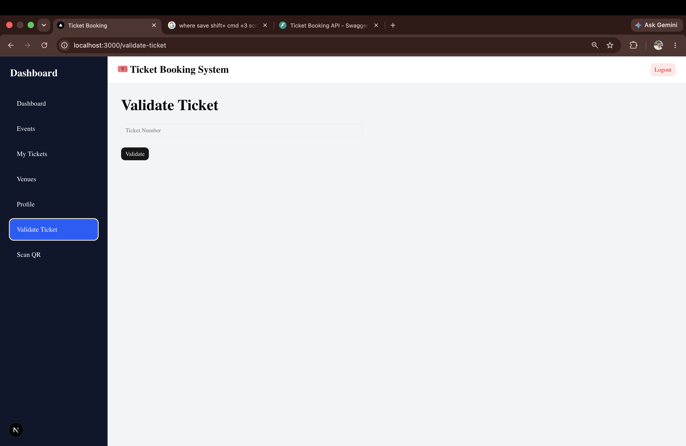
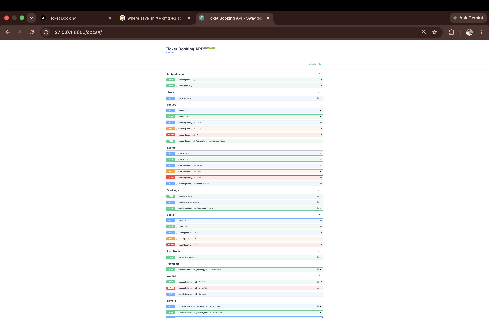

# 🎟️ Ticket Booking System

<p align="center">
  
</p>

<p align="center">


A modern **Full Stack Ticket Booking System** built with **FastAPI**, **Next.js**, **PostgreSQL**, and **JWT Authentication**.

Users can browse events, select seats, securely book tickets, generate QR codes, download PDF tickets, validate tickets, and scan QR codes.

---

## 🚀 Tech Badges


---

## 📊 Repository


---

# ✨ Features

| Feature | Status |
|----------|--------|
| User Registration | ✅ |
| User Login | ✅ |
| JWT Authentication | ✅ |
| Role Based Authorization | ✅ |
| Event Management | ✅ |
| Venue Management | ✅ |
| Automatic Seat Generation | ✅ |
| Seat Hold System | ✅ |
| Double Booking Prevention | ✅ |
| Ticket Booking | ✅ |
| QR Code Generation | ✅ |
| PDF Ticket Generation | ✅ |
| Ticket Download | ✅ |
| Ticket Validation | ✅ |
| QR Scanner | ✅ |
| Dashboard Analytics | ✅ |
| Booking Cancellation | ✅ |
| Swagger API Documentation | ✅ |

---

# 🛠 Tech Stack

## Frontend

- Next.js 16
- React 19
- TypeScript
- Tailwind CSS
- React Query
- Axios
- Shadcn UI

## Backend

- FastAPI
- SQLAlchemy
- Alembic
- PostgreSQL
- Pydantic
- JWT Authentication

## Additional Libraries

- QRCode
- ReportLab
- Uvicorn

---

# 🏗 System Architecture

```text
                   Next.js Frontend
                           │
                           │ REST API
                           ▼
                    FastAPI Backend
                           │
        ┌──────────────────┴──────────────────┐
        │                                     │
 PostgreSQL Database                QR & PDF Service
```

---

# 🎫 Booking Workflow

```text
User Login
      │
      ▼
Browse Events
      │
      ▼
Select Seats
      │
      ▼
Create Booking
      │
      ▼
Generate QR Code
      │
      ▼
Generate PDF Ticket
      │
      ▼
Download Ticket
      │
      ▼
Validate Ticket
```

---

# 📸 Screenshots

| Login | Dashboard |
|-------|-----------|
|  |  |

| Events | Venues |
|--------|---------|
|  |  |

| Seat Selection | My Tickets |
|----------------|------------|
|  |  |

| Validate Ticket | QR Scanner |
|----------------|------------|
|  |  |

| Swagger API |
|-------------|
|  |

---

# 📁 Project Structure

```text
ticket-booking
│
├── backend
│   ├── app
│   ├── alembic
│   ├── storage
│   ├── requirements.txt
│   └── app/main.py
│
├── frontend
│   ├── app
│   ├── components
│   ├── services
│   ├── lib
│   └── package.json
│
├── screenshots
│
├── README.md
└── LICENSE
```

---

# 🔐 Authentication

- JWT Authentication
- Protected Routes
- Current User Dependency
- Role-Based Authorization

---

# ⚙ Backend Setup

```bash
cd backend

python -m venv venv

source venv/bin/activate

pip install -r requirements.txt
```

Run database migrations

```bash
alembic upgrade head
```

Start server

```bash
uvicorn app.main:app --reload
```

---

# 💻 Frontend Setup

```bash
cd frontend

npm install

npm run dev
```

---

# 📖 API Documentation

Once the backend is running:

```
http://127.0.0.1:8000/docs
```

Swagger UI provides complete REST API documentation.

---

# 🌍 Deployment (Planned)

Frontend

- Vercel

Backend

- Render / Railway

Database

- Neon PostgreSQL

---

# 🚀 Future Improvements

- Payment Gateway Integration
- Email Ticket Delivery
- Admin Dashboard
- User Profile Management
- Event Image Upload
- Real-time Seat Locking
- Docker Support
- CI/CD Pipeline
- Cloud Deployment

---

# 👨‍💻 Author

## Tushar Autade

GitHub

https://github.com/tusharautade27

---

# ⭐ Support

If you found this project helpful, please consider giving it a ⭐ on GitHub.

It helps others discover the project and motivates future improvements.